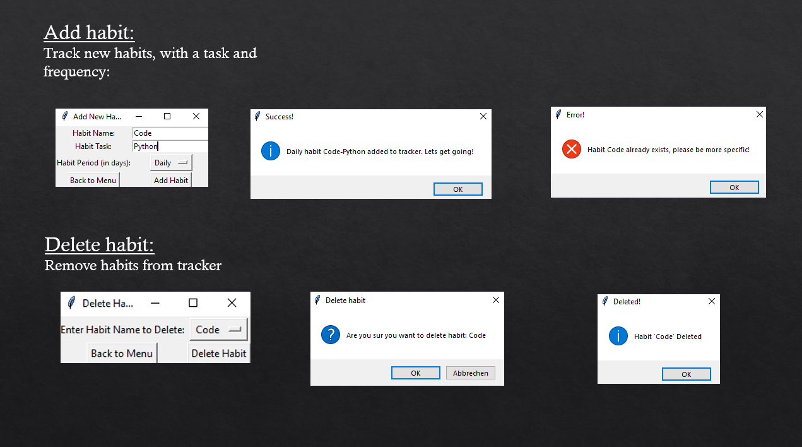
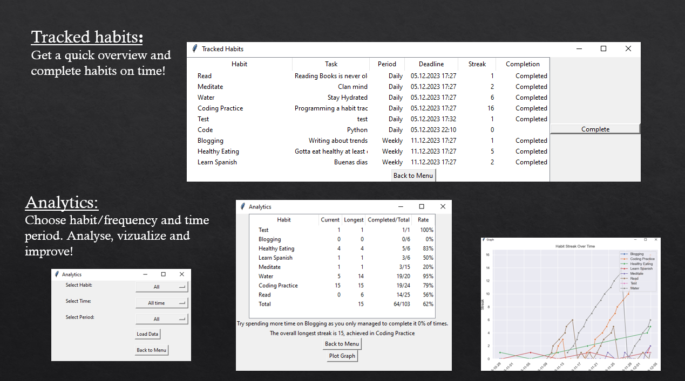

# Habit Tracker application using tkinter

Simple habit tracker designed to keep track and analyze important habits.


## Requirements
- [Python](https://www.python.org/) >= 3.9

## External Modules
- pandas
- seaborn
- matplotlib

## Installation
Clone depository
```bash
 git clone https://github.com/VincentFinkenwirth/Python-Habit-Tracker.git
```
Create virtualenv:
```bash
python -m venv env
```
Navigate to project directory:
```bash
cd Python-Habit-Tracker
```
Install dependencies:
```bash
pip install -r requirements.txt
```

Run:
```bash
python main.py
```

## Features





- Simple tkinter user interface.
- Track, complete and gain streaks.
- Analyze and improve.
- Local sqlite file storage

## Test
Contains UnitTest based on sample data.
```bash
python tracker_unittest.py
```

## License

This project is licensed under the [MIT License](LICENSE).